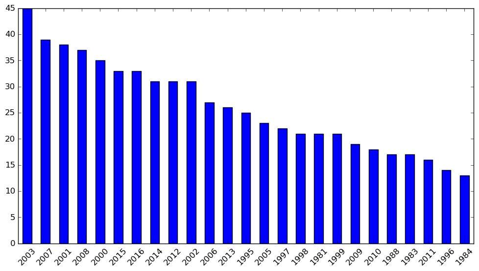
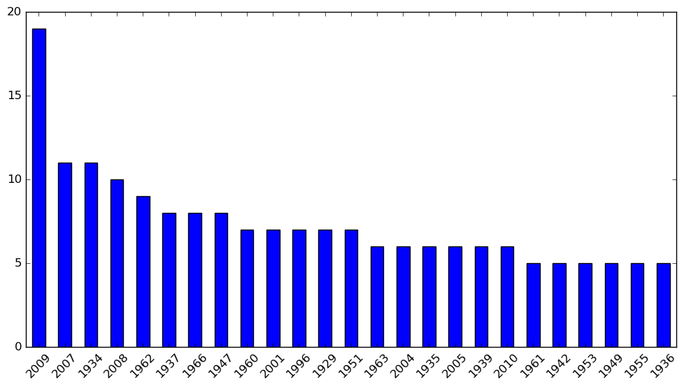

# Pandas-Project

 

## Analizando ataques de tiburón:

### La idea principal es intentar correlacionar la temperatura media anual del mar, con los ataques de tiburón

1. Importamos el archivo CSV, un archivo muy desorganizado y con muchos datos por rellenar
2. Empiezo por algo sencillo, elimino los espacios en los nombres de las columnas, así hago más sencillo el resto del trabajo.
3. Elimino columnas con valos indenticos, o con una cantidad ingente de celdas vacías
4. Observo donde la cantidad de valores nulos es más alta e intento rellenar esa celda con valores, parecidos:
    4.1. En el caso de las localizaciones, he rellenado los valores con las celdas que tenian al lado (Country, Area, Localitation)
    4.2. En el caso de los valores númericos mi primera idea era hacer una media, pero al ser tantos lo he descartado porque falsearia
         en exceo los resultados, por lo que he optado por convertirlos en 0, y así poder filtrar facilmente en las graficas
5. Una vez tengo todo más o menos organizado, saco los datos de donde se producen más ataques:

6. He buscado el historico de la temperatura del agua en ambos lugares, empezamos con Florida:
     

    ###### Datos extraido de la costa de florida:
         
        -2010 fue el año más frío, la temperatura promedio fue: 23℃.
        -2015 fue el más caluroso en Costa este de Florida, la temperatura promedio fue: 26℃. 
        -2002; Durante el día, fue el año con la temperatura media más alta
        -1977; Durante el día, el año con la temperatura más baja
        -------------------------------------------------------------------------------------------------------------------------------
        -Podemos sacar alguna conclusión, pero no contundente:
        --> El mayor número de ataques se produjo en en 2003, aunque la temperatura fue inferior a los años anteriores, estos fueron
            de los más calurosos de la historia, puede que llamados por años anteriores los tiburones se acercaran a la costa año tras año
        --> 2010 y 2009 fueron años con menos de la mitad de ataques que 2003, como vemos en la gráfica de temperatura, esos años bajaron significativamente,esto pudo hacer que los tiburones no volvieran en tanta cantidad.
        
       
      

### Gráfico temperatura media anual del mar de Tasmania
   

      
   ###### Datos extraido del mar de tasmania; mar que baña las costas de New South Wales:
        - Solo nos ofrece dataos hasta 2010, por los que los tenido en los últimos 8 años no lo tendremos en cuenta 
        -1977 fue el año más frío, la temperatura promedio fue: 23℃.
        -1997 fue el más caluroso en Costa este de Florida, la temperatura promedio fue: 26℃.
        ---------------------------------------------------------------------------------------
        
        En este caso vemos un periodo de años 2007,2008, y 2009, que si bien no son los años más calurosos, si que mantienen una temperatura constante, pudiendo llevar a los tiburones a no alejarse mucho de las costas, o regresar un mayor número estos años.
        Esto se puede ver contradecido, ya que en 2010 la temperatura subío casi 0.5 respescto al año anterior, pero los ataques descienden a la mitad, pudiendo deberse, a una mayor precaución por parte de las aturoridades y los bañistas.
        
        Podemos ver está coincidencia en otros casos, por ejemplo, 1934, con 11 ataques (los mismos que en 2007), se puede apreciar, que aunque las aguas son pasaban por una etapa bastante fria, desde el 1930 no paran de subir gradualmente, teniendo el pico más en alto en 1937, otro de los años con mayor número de ataques.
        
        Lo mismo podemos extraer, de la subidoa gradual desde 1946,a 1951 (otro año con bastante número de ataques
        
        Al contratio pasó en 2001, se observa un mayor número de ataques, que aún aumentando la temperatura bastante respecto a los años anteriores, estos tres años se registraró un descenso gradual, 

